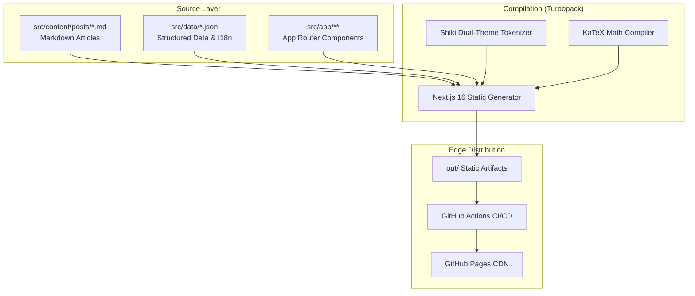

# abdoanss.github.io

Source code for [abdoanss.github.io](https://abdoanss.github.io/), the personal website and technical blog of Abdessamad Anssem.

## Architecture

The website is designed as a zero-runtime static application. Dynamic elements, syntax highlighting, and localized routes are resolved entirely at build time, eliminating cold starts and database overhead while ensuring deterministic edge delivery.



## Technical Specifications

- **Zero Client Overhead Highlighting:** Code blocks are tokenized at build time via Shiki into CSS variables (`--shiki-light`, `--shiki-dark`), enabling instant dark/light switching without client-side highlighting libraries.
- **Pre-rendered Math:** Mathematical formulas are parsed into semantic MathML and HTML via KaTeX during build time.
- **Type-safe Internationalization:** Route-level multilingual dispatch (`/`, `/fr`, `/de`) with strict TypeScript dictionary validation.
- **Static Export Pipeline:** Compiles 14 static pages in under 2 seconds using Next.js 16 with Turbopack.

## Stack

- **Framework:** Next.js 16 (App Router, static HTML export)
- **Styling:** Tailwind CSS v4 (OKLCH color space)
- **Typography:** Geist Mono
- **Syntax Highlighting:** Shiki
- **Math Engine:** KaTeX
- **Icons:** HugeIcons
- **Deployment:** GitHub Pages via GitHub Actions

## Development

```bash
npm install
npm run dev
```

Build static export to `./out`:

```bash
npm run build
```
